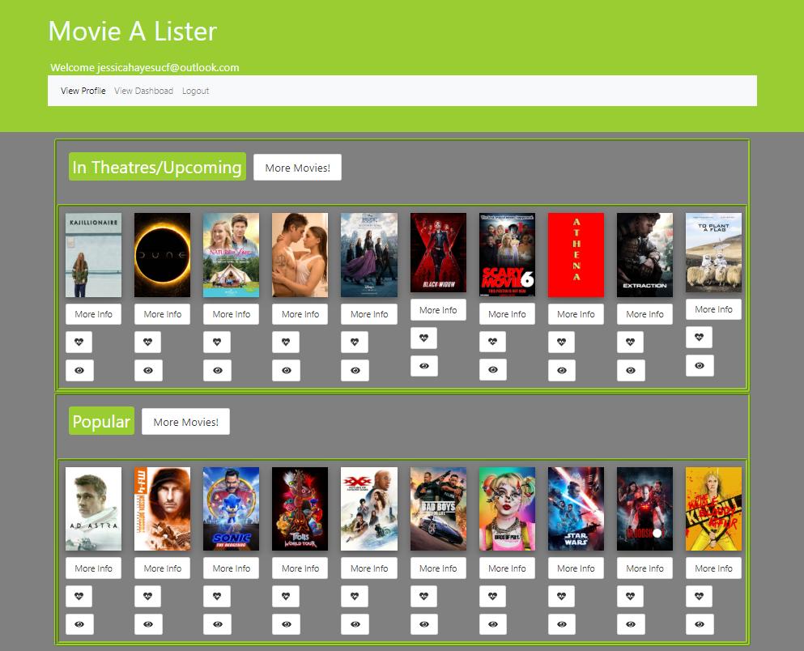
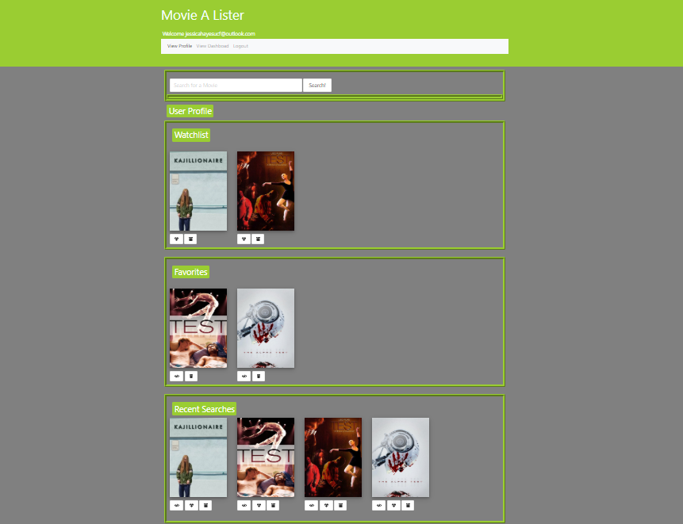

# Movie A-Lister 

## Description

This application allows you to see current popular movies, movies in theaters, and movies that are coming out soon. It also allows the user to search for movies individually. The user can then put the movies in a favorites or want to watch list so that they have a database with the movies that they like or want to watch. 

## Contributors

Jessica Hayes, Arlene Sanchez, Emerson Downing, and Kim Morgan

## Table of Contents

* [Installation](#installation)
* [Usage](#usage)
* [Tests](#tests)
* [License](#license)
* [Contributing](#contributing)
* [Questions?](#questions)

## Installation

To install project dependencies run:

```
npm i
```

## Tests

To run tests run:

```
npm test
```

## Usage

The user needs to sign in before using the application

## License

MIT 

## Screenshots






## Links 

  [Deployed Heroku App](https://moviealister.herokuapp.com/)

  [Github Repo](https://github.com/JesikaRenea/Project2_Group1)

  [Presentation](https://docs.google.com/presentation/d/1Qvn_Sc907o8x8Smzyj3naSA5cVovAs_-vWCV99fZwnk/edit#slide=id.g7458464bff_0_11)

